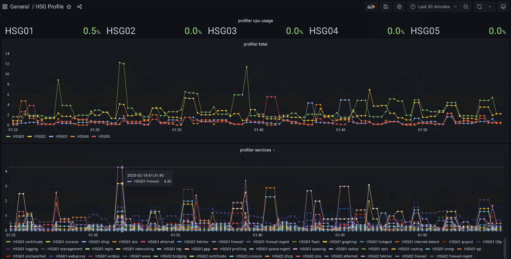
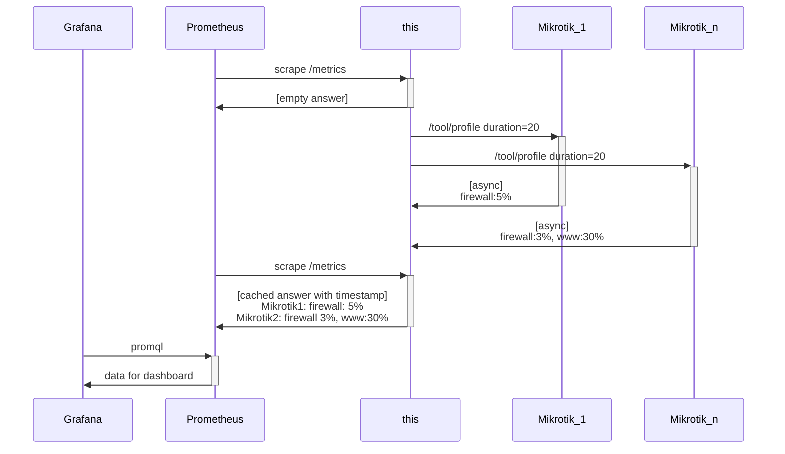

mikrotik_profiler_exporter
==========================



perodically starts /tool/profile for [profile_duration](mikrotik_profiler_exporter.json5) seconds and publishes the
result in prometheus text format with timestamp.



Containerization:

```
MacBook-Pro-von-Markus % docker build . -t mikrotik_profiler_exporter
MacBook-Pro-von-Markus % docker run --rm -it -v"./my_conf.json5:/mikrotik_profiler_exporter.json5:ro" -p49091:49091 mikrotik_profiler_exporter
started profiling task for mymictrod - 172.30.10.1 with dur 20
/metrics endpoint started on port 49091
wait forever
```

Output:

```
# HELP mikrotik_cpu_profiler Profiler CPU
# TYPE mikrotik_cpu_profiler gauge
mikrotik_cpu_profiler{routerboard_address="172.30.10.1",routerboard_name="mymictrod",service="unclassified"} 1.0 1676679424152
mikrotik_cpu_profiler{routerboard_address="172.30.10.1",routerboard_name="mymictrod",service="profiling"} 4.0 1676679424152
mikrotik_cpu_profiler{routerboard_address="172.30.10.1",routerboard_name="mymictrod",service="certificate"} 0.0 1676679424152
mikrotik_cpu_profiler{routerboard_address="172.30.10.1",routerboard_name="mymictrod",service="ssl"} 0.0 1676679424152
mikrotik_cpu_profiler{routerboard_address="172.30.10.1",routerboard_name="mymictrod",service="routing"} 0.5 1676679424152
mikrotik_cpu_profiler{routerboard_address="172.30.10.1",routerboard_name="mymictrod",service="wireless"} 2.0 1676679424152
mikrotik_cpu_profiler{routerboard_address="172.30.10.1",routerboard_name="mymictrod",service="management"} 3.5 1676679424152
mikrotik_cpu_profiler{routerboard_address="172.30.10.1",routerboard_name="mymictrod",service="logging"} 0.0 1676679424152
mikrotik_cpu_profiler{routerboard_address="172.30.10.1",routerboard_name="mymictrod",service="radv"} 0.0 1676679424152
mikrotik_cpu_profiler{routerboard_address="172.30.10.1",routerboard_name="mymictrod",service="networking"} 1.5 1676679424152
mikrotik_cpu_profiler{routerboard_address="172.30.10.1",routerboard_name="mymictrod",service="firewall"} 0.5 1676679424152
mikrotik_cpu_profiler{routerboard_address="172.30.10.1",routerboard_name="mymictrod",service="dns"} 0.0 1676679424152
mikrotik_cpu_profiler{routerboard_address="172.30.10.1",routerboard_name="mymictrod",service="console"} 0.5 1676679424152
mikrotik_cpu_profiler{routerboard_address="172.30.10.1",routerboard_name="mymictrod",service="wireguard"} 0.5 1676679424152
mikrotik_cpu_profiler{routerboard_address="172.30.10.1",routerboard_name="mymictrod",service="ethernet"} 0.5 1676679424152
```

prometheus.yml

```
global:
  scrape_interval: 120s
  scrape_timeout: 100s

  - job_name: 'mikrotik_profiler'
    scrape_interval: 30s
    static_configs:
      - targets: ['mikrotik_profiler_exporter:49091']

```

proql for grafana dashboard

```
mikrotik_cpu_profiler{service="profiling"}
# LEGEND: {{routerboard_name}}

sum by(routerboard_name) (mikrotik_cpu_profiler)

mikrotik_cpu_profiler
# LEGEND: {{routerboard_name}} {{service}}
```


